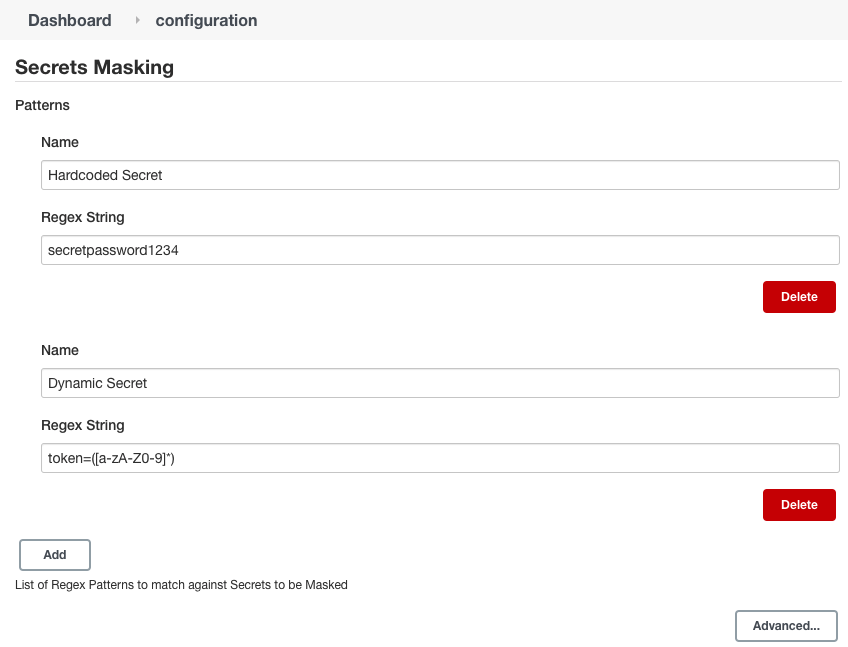

[//]: # (Coverage Icon) 

# **Secrets Mask Plugin**

Jenkins plugin to mask secrets based on configurable regex patterns. 

Patterns are configured under the Jenkins Master system configuration under the **Secrets Masking** tab. Making it easier for system administrators to configure patterns for system-wide sensitive data. 

A Pattern takes a regex string and will compare it to each line of a build's console output. Regex strings with capturing groups will have only the capturing groups matches masked. If the regex string has no capturing groups, the entire matched string will be masked. Masks consist of `*****` followed by the last 2 characters of the secret. 

Patterns are named and must be unique. Creating a new pattern with an existing name will override the previous pattern of the same name.

There is a `Disable Secrets Masking` checkbox in the `Advanced` section to toggle off secret masking. Checking this box will force the plugin to not mask any secrets.

Example configuration:

[//]: # (Development)

## **Development**
To test changes
1. Run `mvn install` to generate an `.hpi` file.
2. Go to your `<jenkins_url>/pluginManager/advanced` and upload the `.hpi` file under the `Upload Plugin` section
3. Restart the Jenkins Master for the plugin to take effect and verify under `<jenkins_url>/pluginManager/installed` that it is the version expected.
4. Go to your Jenkins Master configuration page and under `Secrets Masking`, add any regex patterns you want matched. These will persist across Jenkins restarts.
5. Run a build that has output that contains your expected regex pattern and verify that the secrets are masked with `*****` followed by the last 2 characters of the secret.

To test locally
Run `mvn install hpi:run` to create a local Jenkins server accessible at `http://localhost:8080/jenkins`
 
## Administration
There is a logger that records when the masking functionality is toggled on or off. To record these log messages, a new log listener will need to be setup for the class `com.intuit.dev.build.ibp.GlobalSecretPatternsConfig`.

Jenkins has instructions on setting up a logger [here](https://www.jenkins.io/doc/book/system-administration/viewing-logs/).

[//]: # (Administration)

## **Administration**
There is a logger that records when the masking functionality is turned on or off. To record these log messages, a log listener will need to be setup for the class `com.intuit.dev.build.ibp.GlobalSecretsConfig`

[//]: # (Contributions)

## **Contribution**
Take a look at [CONTRIBUTING](./.github/CONTRIBUTING.md) for contributing to this project.

[LICENSE](./LICENSE)